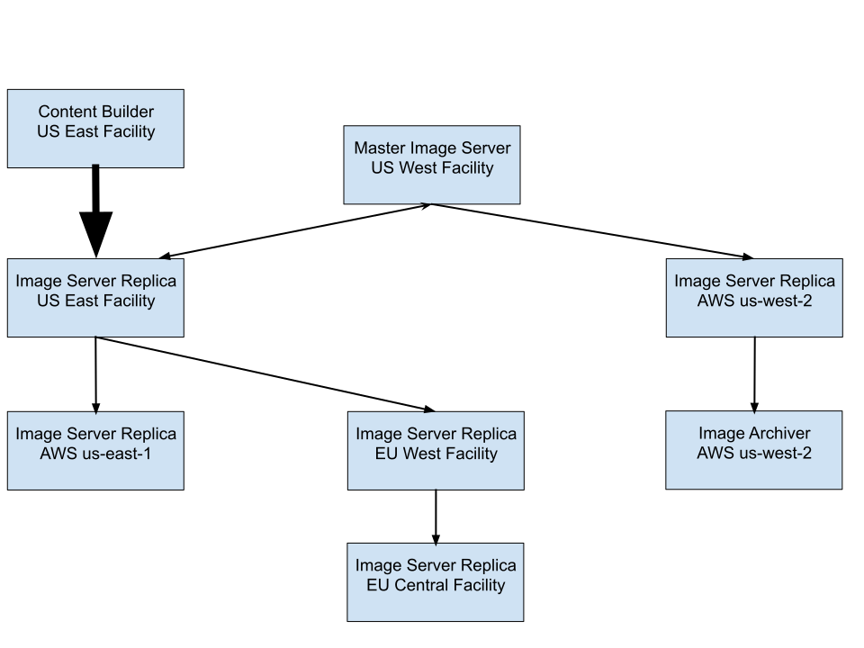
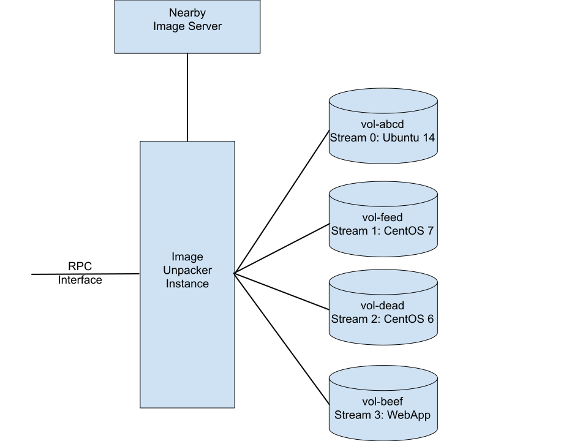
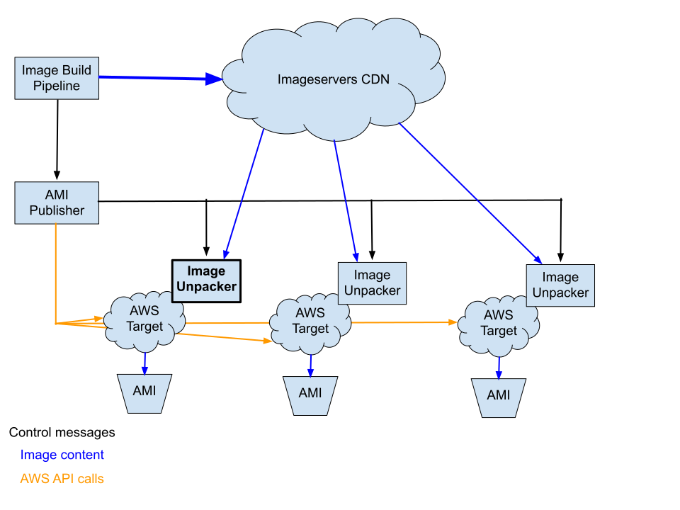
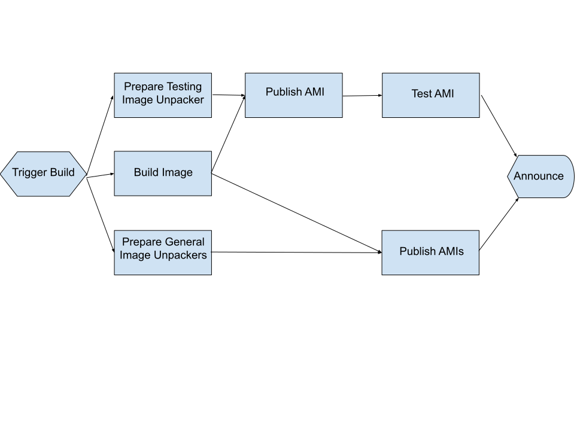

# Accelerating AMI Publication using Dominator

## Richard Gooch

# Abstract

This paper describes a system for publishing identical, encrypted Amazon Machine Images into multiple AWS accounts and regions within 2-3 minutes. This is a huge improvement over previous tools which took nearly two hours to distribute and publish AMIs from image content built on-premise. Combined with a fast content builder such as Imaginator, images can be built and available for use in 3 minutes. This system is available as Open Source code.

# Background

Creating custom Amazon Machine Images (AMIs) is not well supported, and requires a number of steps to make images available. The build model that is best supported by Amazon is to modify an AMI that Amazon provides, and involves the following steps:
- Select an AMI from the AWS Marketplace that has the OS you desire
- Launch an instance (VM) with this AMI
- Log into the instance and install extra packages and make configuration changes
- Stop the instance
- Snapshot the instance
- Release snapshot as the “built image”

This model is not well suited to organisations which want to build images “from scratch”. Building images from scratch allows organisations to:
- Control the contents of their images
- Build images from a common base with limited add ons to support different Cloud providers, thus yielding a more seamless Hybrid Cloud experience

In addition, this model does not support building images on-premise. Companies which are security sensitive may have policies against building (or hosting) source code in a Public Cloud environment, and may not permit storing sensitive key materials there.

To build custom AMIs involves multiple steps, many of which are unreasonably slow:
- Build content (e.g. with Packer, ~5 minutes) to produce a RAW image in a private cloud
- Import RAW image into Amazon S3 using the `s3 cp raw command` (< 1 min for 2GB)
- Convert RAW image in S3 into an AMI using the `aws ec2 import-image command` (35 to 55 minutes)
- Copying an AMI from one region to another (typically over 20 minutes)

In summary, it often takes nearly an hour to import and convert a RAW image into an AMI, even with a modest sized image (2 GB) and a direct connect link between private cloud and AWS with >10 Gb/s. If the AMI is needed in multiple regions, further delays are experienced, as the image will take more time to copy. If the images are encrypted (which is a recommended best practice), yet more time is required to re-encrypt images if they are to be shared between accounts. See the section below on bootstrapping for details on the challenges of copying encrypted images.

## Other Solutions

The [Aminator](https://github.com/Netflix/aminator) system (developed at Netflix and [described here](http://techblog.netflix.com/2013/03/ami-creation-with-aminator.html)) modifies the standard Amazon workflow by using a secondary volume to build AMIs, replacing the more expensive instance launch operation with the significantly faster volume create and attach operations. It is one of the fastest AMI building tools available. This approach requires building the content on AWS. Building on-premises is not possible. Further, with this approach, each region requires its own [Aminator](https://github.com/Netflix/aminator) instance, or else AMIs need to be copied between regions, which is significantly slower. Building images concurrently in each region leads to AMIs which diverge somewhat, as image builds are often not completely repeatable. Best practices require testing to be duplicated in each region if images are not identical.

## Goal

The goal is to reduce the time taken to import images into AWS and produce AMIs globally with identical content in less than 15 minutes.

# The Image Unpacking approach

Use components of the [Dominator](../Dominator/README.md) ecosystem to import images into AWS, separating content building from AMI construction. Images are uploaded to a [Dominator](../Dominator/README.md) imageserver and are automatically replicated to *[imageservers](../../cmd/imageserver/README.md)* in each region, typically within seconds.

In each target (an account, region tuple), an *[ImageUnpacker](../../cmd/image-unpacker/README.md)* service is used to update a dedicated volume for that image stream[^1], using the same OS patching code that [Dominator](../Dominator/README.md) uses to perform fast and robust live updates of machines. This ensures that there is no “leakage” or debris left over from the previous image, and instead yields an image which has only the contents desired. The volumes are persistent and the previous image revision is completely replaced by the new image revision contents. Since the differences between one image revision to the next are usually small (just a few percent), both replication and updates are usually fast.

Because the volumes are persistent, content is cached from one image revision to the next, minimising the time taken to perform the update and leveraging the underlying incremental construction of EBS snapshots.

In detail, the workflow is:
- Build content (< 5 minutes if using Packer on bare metal, < 30 seconds if using a chroot-based builder such as *[Imaginator](../../cmd/imaginator/README.md)*)
- Wait for image build to complete and then upload to the *[imageserver](../../cmd/imageserver/README.md)* (a **[Dominator](../Dominator/README.md)** component) using the *[imagetool](../../cmd/imagetool/README.md)* (< 1 minute)
- Concurrently instruct all *[ImageUnpacker](../../cmd/image-unpacker/README.md)* servers to unpack the image
- Wait for image to be replicated to all regions (optional, typically < 10 seconds)
- Wait for volume to be updated by the *[ImageUnpacker](../../cmd/image-unpacker/README.md)* (typically < 10 seconds)
- Create snapshot and register image (around 1.5 to 3 minutes)

The time taken to go from image content (such as a directory or tarfile containing the entire root file-system) to globally available AMIs is normally 2-3 minutes. The bulk of the time is spent producing the snapshot. These results are based on a 3 GiB AMI with 2 GiB of the file-system used (i.e. 2 GiB of content). The volumes (and thus snapshots and images) are encrypted using the default KMS key for each target. There are no key management headaches which would otherwise be required to share images.

A further benefit of using the [Dominator](../Dominator/README.md) to distribute image content is that it can also easily be used to live patch instances with new image revisions, eliminating the costly volume snapshot and instance spinup times involved in image deployment and yielding times under 2 minutes from image content being built to image deployed on live systems. This supports faster development, testing and deployment.

This approach also supports a Hybrid Cloud or Multi Cloud environment, where common content is built and then distributed to different Cloud providers (i.e. Private Cloud, AWS, GCP, Vagrant, etc.). See the document on [Image Life-cycle Management](https://docs.google.com/document/d/1J15CY2YoWbufPxoaqAVEyhp42N8F3mdnmzkzpA6mNo4/pub) for more information.

## Image Content Distribution

The following diagram shows how image content is distributed in a real-life example. Note the non-optimal placement of the content builder and the master image server. Despite this, the time taken to upload images is still very fast (around 30 seconds). Uploading images requires the entire image contents to be uploaded, to defend against the (extremely remote) possibility of a SHA-512 hash collision. Image replication is much faster because only fresh, unique objects need to be distributed for each new image (since little changes from one image revision to the next).

Note that a single, global *[imageserver](../../cmd/imageserver/README.md)* would be sufficient but less optimal. Placing an *[imageserver](../../cmd/imageserver/README.md)* in each region avoids duplicate inter-region traffic when deploying images into multiple accounts or when distributing multiple image streams with mostly similar content (i.e. different custom images derived from a common base image).

## The Image Unpacker

The following diagram shows an *[ImageUnpacker](../../cmd/image-unpacker/README.md)* instance. Each image stream is pinned to a particular volume. The *[ImageUnpacker](../../cmd/image-unpacker/README.md)* tracks these relationships. It has no knowledge of AWS resources or APIs. It simply deals in image content and block devices attached to it.

## The AMI Publisher

The *[AMI Publisher](../../cmd/ami-publisher/README.md)* is the heart of the system. The *[AMI Publisher](../../cmd/ami-publisher/README.md)* is available as either a command-line utility or a Go package (which may be used in an integrated image release pipeline). The *[AMI Publisher](../../cmd/ami-publisher/README.md)* is all that is required to manage AMI publication for all accounts and all regions. It:
- Is the only component that interacts with AWS APIs
- Discovers *[ImageUnpacker](../../cmd/image-unpacker/README.md)* instances automatically (by searching for instances with the “Name” tag having the `ImageUnpacker` value)
- Creates volumes as needed
- Attaches volumes to *[ImageUnpacker](../../cmd/image-unpacker/README.md)* instances
- Co-ordinates the *[ImageUnpacker](../../cmd/image-unpacker/README.md)*s
- Snapshots volumes
- Registers images from snapshots
- Finishes once AMIs have been published in all requested regions and accounts

The following diagram shows the *[AMI Publisher](../../cmd/ami-publisher/README.md)* and the other components it interacts with.

## Cost-Performance Tradeoff

The approach described here achieves maximum performance by requiring an *[ImageUnpacker](../../cmd/image-unpacker/README.md)* instance in each target (account and region) where AMIs should be made available. For organisations that have a large number of accounts the rental costs for these instances will be multiplied by the number of accounts as well as the number of regions. If rationalising account usage is not feasible, some simple strategies may be employed to reduce costs. These are described below.

**Note that splitting work across multiple accounts creates many other cost inefficiencies aside from building AMIs.**

### Use smaller *[ImageUnpacker](../../cmd/image-unpacker/README.md)* instances

If an *[ImageUnpacker](../../cmd/image-unpacker/README.md)* is likely to be very busy, then a `r4.large` instance ($97/month rental cost) is recommended. An *[ImageUnpacker](../../cmd/image-unpacker/README.md)* is considered busy if any of the following are true:
- More than one image stream will be unpacked at a time
- Successive builds/unpacks for an image stream are less than 2 minutes apart.

However, if an *[ImageUnpacker](../../cmd/image-unpacker/README.md)* instance is not likely to be busy, then a cheaper t2.medium instance ($34/month) will be sufficient, with no measurable increase in latency.

### Integrate testing into the AMI publication workflow

Best practices require that each image be tested before being published for use. Since the approach described here provides identical content across accounts and regions, there is generally no need to test multiple times. The workflow can be split into two branches:
- Testing branch: a faster, more expensive *[ImageUnpacker](../../cmd/image-unpacker/README.md)* instance can be configured in the same target where the image will be tested
- General branch: the remaining *[ImageUnpacker](../../cmd/image-unpacker/README.md)* instances can be slower. By the time the image is tested, these slower *[ImageUnpacker](../../cmd/image-unpacker/README.md)* instances should have finished, and thus there is no latency penalty from using slower instances.

### Stop most *Image Unpacker* instances

This is a more aggressive extension of the previous cost optimisation. If the time taken to perform image testing is more than a few minutes (see below), then *[ImageUnpacker](../../cmd/image-unpacker/README.md)* instances in the general branch can be stopped while idle, and started on-demand when an image build is started. Because stopped instances do not incur rental costs (aside from attached volumes, which have negligible cost), it is viable to have only one long-running *[ImageUnpacker](../../cmd/image-unpacker/README.md)* instance and the rest are stopped most of the time.

Effective AMI testing requires launching a new instance or instances with the AMI, and then performing a series of tests. Since the time to launch a new instance is similar to the time taken to start a stopped instance, this optimisation should generally impose no performance costs.

Note that the *[AMI Publisher](../../cmd/ami-publisher/README.md)* will automatically start an *[ImageUnpacker](../../cmd/image-unpacker/README.md)* instance which is stopped.

The diagram above shows the *[ImageUnpacker](../../cmd/image-unpacker/README.md)* instance on the testing branch in bold. The diagram below shows the image building workflow described in this section.

This shows the dependency flow between the various stages. Events that occur at approximately the same time are vertically aligned, with time flowing from left to right. If an *[ImageUnpacker](../../cmd/image-unpacker/README.md)* instance is stopped it will be started during the prepare stage.

# Bootstrapping

The image unpacking approach described above has an interesting bootstrapping problem. Since running instances are required to generate or publish images, there is a circular dependency as instances require images in order to launch. This section describes how best to bootstrap image publication and covers other approaches which were discarded.

## The First *[ImageUnpacker](../../cmd/image-unpacker/README.md)* instance

The simplest approach would appear to be to launch an instance with an AWS Marketplace AMI (image) of one of the Linux distributions (Debian, Ubuntu, CentOS, etc.) and then install the `image-unpacker` binary on the instance. This approach is discouraged as instances that are launched from Marketplace images are not backed by encrypted volumes. The `image-unpacker` binary requires a (secret) SSL cert which gives it access to the *[imageserver](../../cmd/imageserver/README.md)* content distribution network. This secret is stored on the root file-system. Best practices prohibit storing secret files on un-encrypted permanent storage. This prohibition is designed to defend against accidental or unauthorised data loss by the Public Cloud provider. A lost storage device or computer is insufficient to recover data if the encryption keys are managed by a KMS (Key Management Service).

If encrypted EBS-backed “base” images are already available in your AWS account (such as when you already have an image build system and wish to migrate to the image unpacking system), then the simplest approach is to launch an instance using one of these images and installing the `image-unpacker` binary and SSL key on the instance. You now have your first *[ImageUnpacker](../../cmd/image-unpacker/README.md)* instance. Alternatively, instead of copying over the `image-unpacker` binary you can set the `RequiredImage` tag to specify a [Dominator](../Dominator/README.md) image which contains the `image-unpacker` binary and configuration. The [Dominator](../Dominator/README.md) will automatically convert the new instance into a running *[ImageUnpacker](../../cmd/image-unpacker/README.md)*. See below for a rationale for this approach.

If no suitable base images are available, you can build a base image using your existing image build pipeline and using the AWS tools to import the image. Be sure to enable encryption. This will be your initial “base” image. Once imported, continue as above.

If you don’t have an image build pipeline (or set of tools), then Wow! You really are starting from scratch. In that case, you could:
- Find a Marketplace image
- Launch an instance from that
- Optionally delete packages you don’t want
- Stop the instance
- Copy-encrypt the snapshot
- Terminate the instance
- Register an AMI from the snapshot

The newly registered AMI will be your initial encrypted base image. It is safe to store secret files in instances launched with this AMI. Continue as above.

## All the other *[ImageUnpacker](../../cmd/image-unpacker/README.md)* instances

Sooner or later, you will want to expand into more regions (more capacity, redundancy, lower latency to your customers or other reasons). You may also (reluctantly) have to expand into more AWS accounts. In either case, you will want to publish and distribute images into these targets, so that will require an *[ImageUnpacker](../../cmd/image-unpacker/README.md)* instance in each target. So, once again, you will need base images in each account to start off.

The “obvious” approach is to copy AMIs between targets. This is a straightforward (but slow) operation when copying between regions. When copying between accounts this is surprisingly painful because of how encryption keys are managed. To copy between accounts, the following steps are required:
- Create a special “sharing key”
- Copy the AMI snapshot into the same account with the sharing key
- Share the key with the target account
- Share the snapshot with the target account
- Ask the administrator of the target account to give you access to the sharing key
- Copy the shared snapshot (in the target account) to a new snapshot encrypted with the default key
- Delete the shared snapshot
- Register the new snapshot as an AMI

The re-encryption steps can be avoided if all your AMIs are encrypted with the sharing key rather than the default key. The disadvantage of using a sharing key is that all users/roles in the accounts will need to be given access to the sharing key. This again requires more account administrator involvement, filing tickets, etc. The default key “just works”, which is why it is the preferred key to use.

We desire a more automated solution that minimises account administrator involvement. The *[AMI Publisher](../../cmd/ami-publisher/README.md)* can be used to bootstrap *[ImageUnpacker](../../cmd/image-unpacker/README.md)* instances into new targets, once you have your first *[ImageUnpacker](../../cmd/image-unpacker/README.md)* and a base image it has published, somewhere in AWS. The steps are fully automated and do not require any account administrator involvement (other than being given API access keys for the accounts you wish to publish images into). The *[AMI Publisher](../../cmd/ami-publisher/README.md)* can bootstrap *[ImageUnpacker](../../cmd/image-unpacker/README.md)* instances into multiple (all) accounts and regions concurrently with a single command and can be re-run to bootstrap *[ImageUnpacker](../../cmd/image-unpacker/README.md)* instances in new regions and accounts as they become available.

Under the covers, the following steps are taken for each target:
- Import your SSH public key
- Launch a temporary instance from a Marketplace AMI with a secondary (encrypted) volume attached
- Find an existing nearest *[ImageUnpacker](../../cmd/image-unpacker/README.md)* instance with one of your unpacked base images
- Copy the image contents via SSH to the secondary volume of the temporary instance
- Snapshot the volume
- Terminate the temporary instance
- Register an AMI using the snapshot. This will be the first base image for that target
- Launch a second instance (which will become the permanent *[ImageUnpacker](../../cmd/image-unpacker/README.md)* instance for that target) with the newly registered base image and set the `RequiredImage` tag to specify a [Dominator](../Dominator/README.md) image which contains the `image-unpacker` binary and configuration. The [Dominator](../Dominator/README.md) will automatically convert the new instance into a running *[ImageUnpacker](../../cmd/image-unpacker/README.md)*.

This approach leverages the same system (the [Dominator](../Dominator/README.md)) which is used to update *[ImageUnpacker](../../cmd/image-unpacker/README.md)* instances (and other infrastructure that is not suited to the container paradigm) to bootstrap from a base image to a functioning *[ImageUnpacker](../../cmd/image-unpacker/README.md)*. By using the nearest existing *[ImageUnpacker](../../cmd/image-unpacker/README.md)* instance to copy the image from, cross-region traffic can be minimised.

A further optimisation is that the *[AMI Publisher](../../cmd/ami-publisher/README.md)* will skip the steps required to register a base image if one already exists in a target. This is particularly helpful if *[ImageUnpacker](../../cmd/image-unpacker/README.md)* instances are destroyed or if migrating into multiple targets (where you already have base images) to the image unpacking system.

# Support for Instance-backed (S3) AMIs

This approach also supports building instance-backed (S3) AMIs with high performance. The hard work of distributing and unpacking image content is already solved. The differences compared to publishing EBS-backed AMIs are:
- Only one *[ImageUnpacker](../../cmd/image-unpacker/README.md)* instance per region is required
- The `ec2-bundle-image` and `ec2-upload-bundle` utilities from AWS are required on the *[ImageUnpacker](../../cmd/image-unpacker/README.md)* instances (this requires credentials to upload to S3 buckets)
- AMIs are shared between accounts

This is not quite as fast as publishing AMIs; whereas creating EBS snapshots typically takes 3 minutes or less, bundling and uploading S3 AMIs takes around 6 minutes. Nevertheless, this is still quite performant. Further, there is scope for optimising the bundle+upload stages, by replacing the AWS tools (written in Ruby) with a tool written in Go and optimised to this workload (expectation is around 3 minutes, similar to the EBS snapshot time).

[^1]: An image stream is a sequence of image releases/revisions (e.g. base/CentOS-7 would be one image stream and base/Ubuntu-14.04 would be another).
